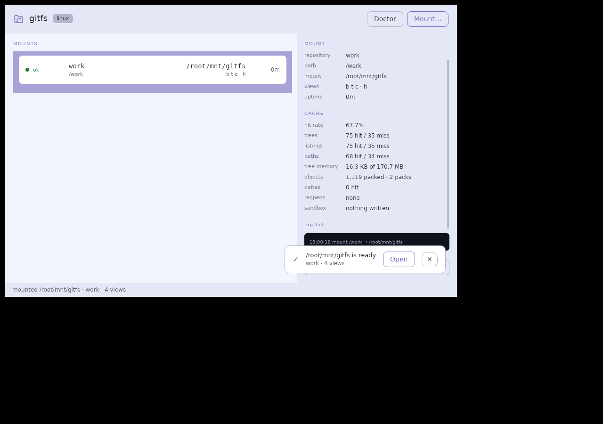
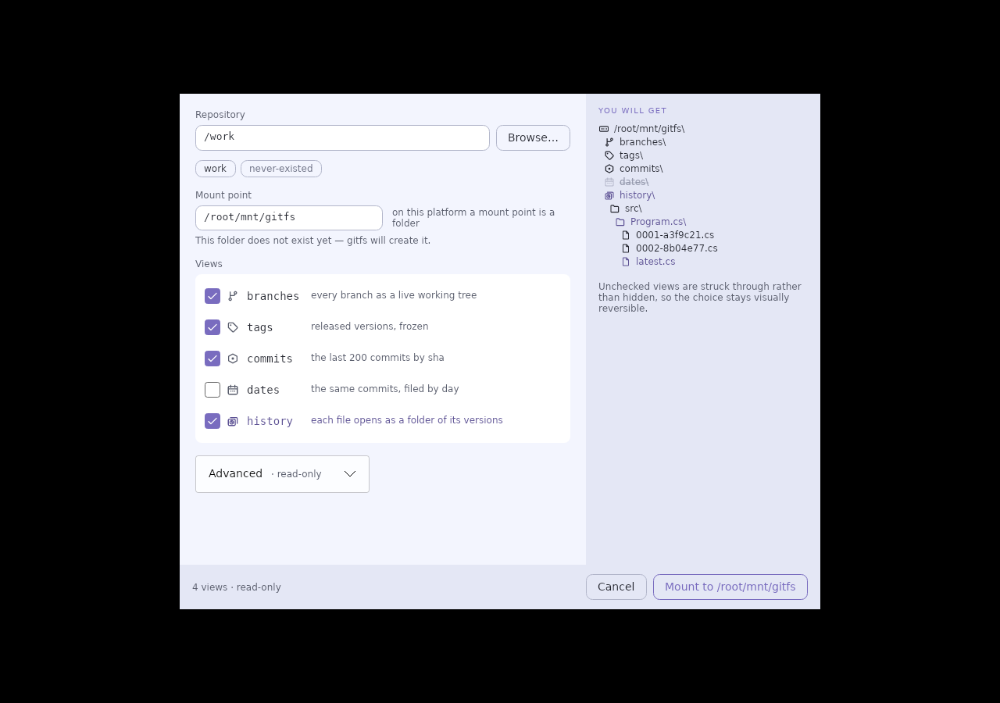
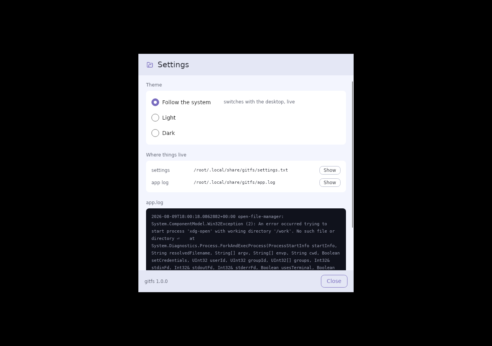

# gitfs

[](https://github.com/090TYPE/gitfs/actions/workflows/ci.yml)

**Монтирует git-репозиторий как диск. Коммиты — папки. Файл — тоже папка, внутри все его версии.**

```
G:\
├─ branches\main\src\Program.cs        рабочее дерево любой ветки
├─ tags\v1.0\                          выпущенные версии
├─ commits\a3f9c21\                    снимок любого коммита
├─ dates\2026-08-07\                   каким проект был в тот день
├─ history\src\Program.cs\             ← файл раскрылся папкой
│     0001-a3f9c21.cs
│     0002-8b04e77.cs
│     latest.cs
└─ .gitfs\                            диагностика внутри самого тома
      status.txt  log.txt  overlay\
```

Посмотреть, чем был файл три месяца назад, не делая `checkout`, не трогая
рабочую копию и не выходя из Проводника, IDE, `grep` или Word.

## Зачем, если есть git

git разговаривает только с git-инструментами. Файловая система — со всем.

* **Бинарные файлы.** Для текста история решена: `git show`, `git log -p`,
  timeline в IDE. Для `.docx`, `.psd`, `.pdf`, картинок и ноутбуков git
  показывает мусор из байтов. Здесь — двойной клик.
* **Рабочая копия не трогается.** `checkout` посреди отладки — это грязное
  дерево и переиндексация проекта в IDE. Монтирование не делает ничего из этого.
* **Инструменты, не знающие про git, начинают знать.** Всё, что принимает
  путь: WinMerge, `ripgrep` по срезу за нужную дату, линтер на старом дереве.
* **Люди без git.** Технический писатель открывает папку с датой и видит
  проект таким, каким он был.

Честно о границах: `git worktree add` уже даёт checkout любого ref в папку —
это прямой конкурент вьюхам `branches/`, `commits/` и `dates/`. Уникально
здесь `history/`: все версии одного файла как папка, мгновенно, без N команд
и без N checkout-ов.

## Установка

Бинарники — в [релизе](https://github.com/090TYPE/gitfs/releases/latest),
рядом `SHA256SUMS.txt` (проверяется `sha256sum -c`).

```bash
scoop install https://raw.githubusercontent.com/090TYPE/gitfs/main/packaging/scoop/gitfs.json
```

```bash
winget install --manifest packaging\winget
```

Нужен .NET 8 и драйвер файловой системы: на Windows
[WinFsp](https://winfsp.dev/rel/), на Linux пакет `fuse3`. Чего не хватает —
скажет `gitfs doctor`.

## Как пользоваться

```bash
gitfs mount C:\src\myrepo G:        # Ctrl+C размонтирует
gitfs mount ~/src/myrepo /mnt/gitfs
gitfs doctor .                      # что не так с окружением
gitfs tree . history/README.md      # обойти дерево без монтирования
gitfs list                          # какие тома держит gitfs
gitfs purge                         # убрать песочницы после аварий
```

`gitfs tree` работает без всякого драйвера — это тот же виртуальный слой,
который увидит Проводник, только выведенный в терминал.

Настройки монтирования одинаковы у окна и у команды — то, что доступно
только через диалог, для скриптов и CI не существует:

```bash
gitfs mount . /mnt/gitfs --read-only --history-ref=v1.0 --commit-limit=50
gitfs tree  . history --history-ref=v1.0     # история такой, какой была тогда
```

`--views`, `--keep-overlay`, `--portable-names`, `--history-limit`,
`--cache-mb`, `--max-blob-mb` — там же; `gitfs --help` перечисляет все.

Что именно делает том прямо сейчас, видно **не выходя из тома**: `.gitfs/`
держит `status.txt` со счётчиками кэшей и пакетов, `log.txt` с событиями
(обрезание истории, переоткрытие пакетов) и `overlay/` — только для чтения,
чтобы видеть, что записано в песочницу.

### Приложение

```bash
dist/win-x64/Gitfs.App.exe
```

Окно со списком монтирований, живыми счётчиками кэша и хвостом журнала;
диалог с превью дерева и настройками, каждая из которых действует; иконка в
трее, где состояние читается формой значка, а не только цветом. Светлая и
тёмная темы, по умолчанию — как в системе. Один код на Avalonia; монтируют
Windows и Linux, на macOS кнопка заблокирована с указанием причины.



Слева — диалог с раскрытыми настройками, справа — экран первого запуска.
Все снимки сделаны `tools/gui-check.sh` под Xvfb, а не собраны руками.

<p>
  
  
</p>

Настройки: тема, где лежат файлы, хвост собственного журнала приложения.
Настроек ровно столько, сколько у приложения есть, — переключатель, который
ничего не меняет, хуже отсутствующего.

<p>
  
</p>

### В Проводнике

У продукта почти нет своих экранов: главный интерфейс — чужой. Поэтому том
приносит своё оформление с собой. Корневые папки вьюх получают иконки через
`desktop.ini`, а сами иконки лежат **на томе**, в `.gitfs/icons/` — ссылка
относительная и не зависит ни от буквы диска, ни от того, куда установлен
gitfs. Служебные файлы скрыты атрибутом и в обычном листинге не видны.


Только на Windows: вне её про `desktop.ini` не знает ни один файловый
менеджер, и класть его туда значило бы положить служебный файл в каждую
вьюху ради оформления, которого не будет.

## Запись разрешена, но в песочницу

Жёсткий read-only ломает Word и Excel: они пишут lock-файлы рядом с
открываемым файлом. Записи уходят в copy-on-write overlay и **в репозиторий
не попадают никогда** — это главный инвариант, и он проверяется отдельным
шагом в CI после каждого прогона приёмки.

## Как устроено

```
Gitfs.App            окно, диалог монтирования, трей (Avalonia)
Gitfs.Cli            doctor · tree · cat · mount · purge
Gitfs.Diagnostics    проверки окружения
Gitfs.Mount.WinFsp   адаптер Windows: колбэки → границе, коды → NTSTATUS
Gitfs.Mount.Fuse     адаптер Linux:   колбэки → границе, коды → -errno
─────────────────── IMountTarget ───────────────────  граница переносимости
Gitfs.Vfs            VirtualTree, пять вьюх, NamePolicy, OverlayStore
Gitfs.Core           свой ридер формата git — ноль нативных зависимостей
```

Всё ниже границы не знает о существовании файловой системы и проверяется без
единого монтирования. Вторая платформа стоила одного проекта и ни строчки
изменений ниже границы.

Несколько решений, определивших остальное:

* **Свой ридер git вместо LibGit2Sharp.** Три целевые ОС и ноль нативных
  бинарников. Loose-объекты, packfile v2 с 8-байтными смещениями, обе
  разновидности дельт, `commit-graph`.
* **Свой биндинг к libfuse3.** Смещения полей в `struct fuse_operations` и
  `stat` не взяты из документации: их печатает
  [проба на C](tools/fuse-abi-probe.c) на целевой платформе, вывод лежит
  фикстурой, а CI переснимает раскладку прямо на раннере. Ошибка в смещении не
  даёт ошибки компиляции — она даёт вызов не той функции.
* **Листинг ≠ разрешение пути.** `commits/` перечисляет последние 200, но
  открывается любой валидный SHA — модель `/proc`: видно не всё, доступно всё.
* **Иммутабельные снапшоты.** Операция читает ссылку на снапшот один раз;
  смена эпохи посреди чтения не наблюдается.
* **Правила имён.** git разрешает `aux.c`, `a:b*c?.txt` и `README` рядом с
  `readme`; Windows — ничего из этого. Три обратимых правила применяются
  только к отображаемому имени.

## Производительность

Синтетический репозиторий из 10 001 коммита, прогретый кэш:

| | |
|---|---|
| монтирование | 24 мс |
| lookup p50 / p99 | 0.055 / 0.080 мс |
| первое открытие `history/<файл>/` | 142 мс, повторное 0.13 мс |
| память | 5 МБ |

Через ядро, на смонтированном томе (`tools/bench-fuse.sh`, блоб 64 МБ):
**827 МБ/с** против 5.2 ГБ/с у обычной ФС, накладные расходы одного `stat` —
0.01 мс.

Открытие `history/` изначально не укладывалось в бюджет: 2487 мс против
разрешённых 2000, потому что обход разбирал каждый из 10 000 коммитов.
Лечится чтением `commit-graph`, где дерево и родитель лежат в 36 байтах
индекса, — семнадцатикратное ускорение.

## Тесты

```bash
dotnet test gitfs.slnx
powershell -File tools/acceptance.ps1 G:      # Windows, на живом томе
tools/acceptance.sh /mnt/gitfs                # Linux
tools/linux-check.sh                          # весь Linux-контур в docker
tools/gui-check.sh                            # окна под Xvfb, со снимками
```

459 тестов, одно и то же число на обеих платформах — и приёмка против
**смонтированного диска**, по два прогона на каждой платформе в CI на
раннерах GitHub.

Методика — дифференциальная: эталоном служит сам git. Объекты сверяются
побайтно с `git cat-file`, смещения в packfile — с `git verify-pack -v`,
деревья — с `git ls-tree -z`, история — с `git rev-list --first-parent`.

Юнит-тесты покрывают всё ниже границы `IMountTarget`. Но каждый дефект,
стоивший этому проекту работоспособности, жил **выше** неё — в договоре с
ядром: `O_TRUNC`, который обязан отрабатывать адаптер; потерянный бит
`+x`, из-за которого ни один скрипт не запускался с тома; аренда снапшота,
отпущенная дважды, после чего том вставал навсегда. Поэтому оба контура
заканчиваются живым томом, а не сборкой.

То же и с окном. `tools/gui-check.sh` под Xvfb не просто запускает
приложение: он доводит его мышью до настоящего тома и снимает экраны. Так
нашлись раскрытая секция настроек, не влезавшая в окно; кнопка «Смонтировать»,
которая не могла сработать, потому что папки не существовало; экран первого
запуска, падавший в журнал и не появлявшийся вовсе; и счётчики кэша, честно
стоявшие на нуле, потому что панель никто не перечитывал.

## Ограничения

* SHA-1 репозитории; SHA-256 определяется и отвергается внятной ошибкой.
* Submodules показываются маркером, без раскрытия. Git LFS: pointer-файл
  отдаётся как есть.
* Переименование обрывает историю в `history/` — путь ищется буквально.
* macOS не поддержан: macFUSE ставится расширением ядра и требует ослабления
  SIP, поэтому проверить его негде.
* Цикл FUSE однопоточный: операции под Linux сериализованы.

## Лицензия

MIT.
