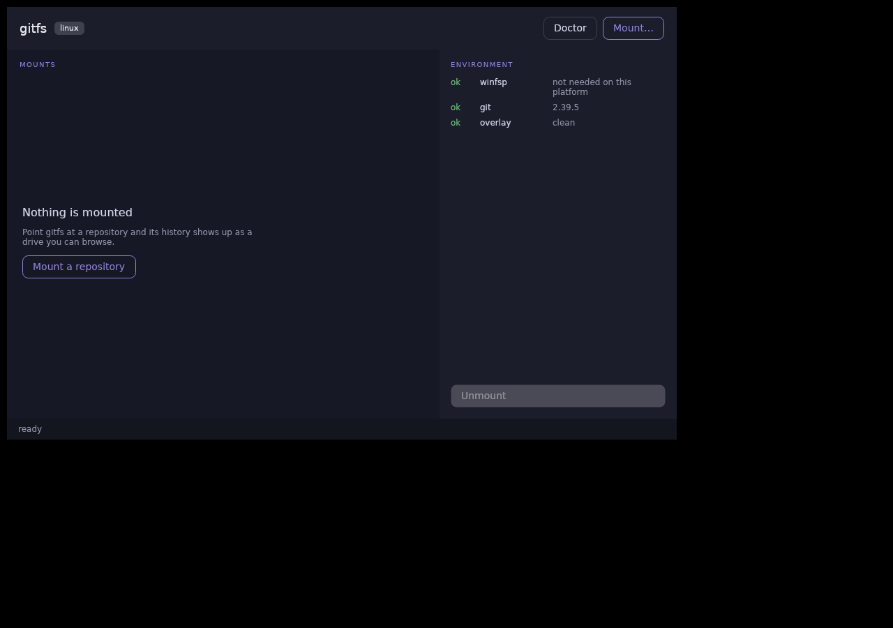

# gitfs

**Монтирует git-репозиторий как диск. Коммиты — папки. Файл — тоже папка, внутри все его версии.**

```
G:\
├─ branches\main\src\Program.cs        рабочее дерево любой ветки
├─ tags\v1.0\                          выпущенные версии
├─ commits\a3f9c21\                    снимок любого коммита
├─ dates\2026-08-07\                   каким проект был в тот день
└─ history\src\Program.cs\             ← файл раскрылся папкой
      0001-a3f9c21.cs
      0002-8b04e77.cs
      latest.cs
```

Посмотреть, чем был файл три месяца назад, не делая `checkout`, не трогая
рабочую копию и не выходя из Проводника, Far, IDE, `grep` или Word.

---

## Зачем это, если есть git

git умеет разговаривать только с git-инструментами. Файловая система умеет
разговаривать со всем.

* **Бинарные файлы.** Для текста история решена — `git show`, `git log -p`,
  timeline в IDE. Для `.docx`, `.xlsx`, `.psd`, `.pdf`, картинок, ноутбуков git
  показывает мусор из байтов. Чтобы увидеть макет двухмесячной давности, нужно
  найти коммит, сделать `git show sha:path > temp.psd`, открыть, убрать за собой.
  Здесь — двойной клик.
* **Рабочая копия не трогается.** `checkout` посреди отладки — это грязное
  дерево, переиндексация проекта в IDE, инвалидация сборки. Read-only
  монтирование не делает ничего из этого.
* **Инструменты, не знающие про git, начинают знать.** Всё, что принимает путь:
  WinMerge, `ripgrep` по срезу за нужную дату, линтер на старом дереве, Far.
* **Люди без git.** Технический писатель или тестировщик открывает папку с датой
  и видит проект таким, каким он был.
* **Безопасный осмотр чужого репозитория.** gitfs по инварианту не выполняет
  ничего из репозитория — ни хуков, ни фильтров, ни `git`-бинарника.

Честно о границах: `git worktree add` уже даёт checkout любого ref в отдельную
папку — это прямой конкурент вьюхам `branches/`, `commits/` и `dates/`.
Уникально здесь `history/`: все версии одного файла как папка, мгновенно, без N
команд и без N checkout-ов.

## Чем отличается от похожего

| Проект | Что делает | Отличие |
|---|---|---|
| `presslabs/gitfs` | Python + FUSE, Linux/macOS; монтирует **одну ветку** как рабочую папку и автоматически коммитит записи | «git как Dropbox». Здесь наоборот: вся история только на чтение, записи в репозиторий не попадают никогда |
| VFS for Git / Scalar | виртуализация рабочей копии огромных репозиториев | решает проблему размера checkout-а, а не просмотра истории |
| `git worktree` | полноценный checkout любого ref в папку | по одному ref за раз, каждый — реальные файлы на диске; `history/` не покрывает |

## Что уже работает

Смонтированный том, приложение с интерфейсом и CLI. Ниже — настоящий вывод на
репозитории самого gitfs.

### Приложение

```bash
dist/win-x64/Gitfs.App.exe
```

Окно со списком монтирований и панелью диагностики, диалог монтирования с
живым превью дерева, иконка в трее — закрытие окна прячет его, тома
продолжают работать. Один код на Avalonia под Windows, macOS и Linux.

Окно проверено на обеих платформах — под Linux оно поднимается в контейнере
под Xvfb, и снимок снимается там же, а не рисуется в макете:

```bash
tools/gui-check.sh
```



Проверка не ограничивается «процесс не упал»: она ищет окно по имени и
считает цвета на снимке — пустое чёрное окно тоже «есть», и отличить его от
нарисованного интерфейса можно только посмотрев. На macOS кнопка
монтирования заблокирована с указанием причины: macFUSE ещё не подключён.

Этот же снимок сразу показал дефект, которого не видел ни один тест:
`doctor` под Linux писал «winfsp не нужен на этой платформе» и **молчал про
libfuse3** — то есть рапортовал «всё в порядке» машине, на которой
монтирование невозможно. Теперь каждая платформа проверяет свой драйвер.

```
$ gitfs tree . history/src/Gitfs.Core/Objects/PackFile.cs
file           13334  2026-08-08  0001-d8d9f7a.cs
file            9823  2026-08-08  0002-bdae5f1.cs
file            8148  2026-08-07  0003-04a8b5c.cs
file           13334  2026-08-08  latest.cs
```

В размерах читается биография файла: 8148 байт первой реализации → 9823 после
закалки по код-ревью → 13334 после кэшей.

```
$ gitfs doctor .
ok   winfsp                 2.1.24255.2da97d4
ok   git                    2.54.0.windows.1
ok   drive letters          G H I J K free
ok   repository             C:\Users\090\Documents\GitHub\gitfs\.git
ok   hash format            sha1
ok   history                complete
warn accelerators           none
     → run git commit-graph write --reachable to speed up dates/ and history/
ok   overlay                clean

7 ok · 1 warning · 0 failures
```

Каждая строка — либо «дальше можно», либо ровно одно действие. Совет обязан
вести к работающей команде: `doctor` однажды предлагал `gitfs unmount --purge`,
которой не существовало, — теперь на месте совета настоящая `gitfs purge`,
а `unmount` объясняет, что том снимается там, где создан.

**`gitfs tree` работает без установки чего-либо** — это тот же виртуальный слой,
который увидит Проводник, только выведенный в терминал. Само монтирование
требует драйвера: на Windows [WinFsp](https://winfsp.dev/rel/) (ставится за
десяток секунд, перезагрузка не нужна), на Linux — пакета `fuse3`.

```bash
gitfs mount C:\src\myrepo G:
```

```bash
gitfs mount ~/src/myrepo /mnt/gitfs
```

### Linux

Адаптер FUSE — собственная привязка к libfuse3, без сторонних пакетов.
Смещения полей в `struct fuse_operations`, `stat` и `fuse_file_info` не
взяты из документации: их печатает [`tools/fuse-abi-probe.c`](tools/fuse-abi-probe.c)
на целевой платформе, вывод лежит фикстурой, а тест сверяет с ним каждую
константу. Ошибка в смещении не даёт ошибки компиляции — она даёт вызов не
той функции, поэтому эталоном здесь может быть только сам ABI.

Проба сразу окупилась: `st_nlink` лежит **перед** `st_mode`, `fh` — на
шестнадцатом байте, а не на восьмом, и между `create` и `utimens` стоит
`lock`. Все три «очевидных» варианта неверны.

Весь Linux-контур — тесты, монтирование и приёмка — прогоняется одной
командой с любой машины, где есть docker:

```bash
tools/linux-check.sh
```

## Состояние по вехам

| | Веха | Статус |
|---|---|---|
| M1 | Ядро чтения git: loose-объекты, packfiles, обе разновидности дельт, refs, парсеры, обходчики | готово |
| M2 | Виртуальное дерево: снапшоты, грамматика путей, политика имён | готово |
| M3 | Адаптер WinFsp, `IMountTarget`, CLI | собран; приёмка требует драйвера |
| M4 | Вьюхи `tags`, `commits`, `dates`, `history` | готово |
| M5 | Overlay-песочница | готово |
| — | Приложение с интерфейсом и треем (Avalonia) | готово |
| M6 | Адаптер FUSE (Linux) | готово: 28/28 приёмки на томе в Linux |
| M7 | Ускорители (commit-graph), бенчмарки, нагрузочные тесты | готово |
| M8 | Релиз: single-file бинарники, winget/scoop | бинарники и `tools/publish.ps1` есть, манифестов нет |

## Производительность

Бюджеты заданы спекой §16, замеры — на синтетическом репозитории из **10 001
коммита** (`tools/Gitfs.Bench`), прогретый кэш:

| Бюджет | Измерено |
|---|---|
| монтирование < 500 мс | **24 мс** |
| Lookup p50 < 1 мс | **0.055 мс** |
| Lookup p99 < 10 мс | **0.080 мс** |
| листинг директории < 50 мс | **0.1 мс** |
| последовательное чтение > 100 МБ/с | **231 МБ/с** |
| первое открытие `history/<файл>/` < 2 с | **142 мс** (повторное — 0.13 мс) |
| память | **5 МБ** |

```bash
dotnet run -c Release --project tools/Gitfs.Bench -- <путь к репозиторию>
```

### Сколько стоит проход через ядро

Таблица выше измерена **ниже границы** `IMountTarget` — там нет ни
переключений контекста, ни копирования буферов ядром, ни round-trip до
`/dev/fuse`. Это честные числа для VFS и ничего не говорят о том, что
почувствует `cat` на смонтированном томе. Поэтому под Linux то же меряется
насквозь:

```bash
tools/bench-fuse.sh /mnt/gitfs
```

| Через ядро | Измерено |
|---|---|
| последовательное чтение (блоб 64 МБ) | **827 МБ/с** (тёплое — 891) |
| та же операция мимо gitfs, обычная ФС | 5.2 ГБ/с |
| накладные расходы одного `stat` | **0.01 мс** |
| обход всего дерева ветки | 21 мс на 146 файлов |
| первое открытие `history/<файл>/` | 12.6 мс (повторное — 3.2) |

Бюджет «> 100 МБ/с» выполняется и здесь — а это уже требование к настоящей
файловой системе, а не к слою под ней. Цена одного похода в адаптер — около
десяти микросекунд; всё остальное в замере `stat` занимает запуск процесса,
что видно только потому, что скрипт меряет ту же петлю на обычном файле и
вычитает.

Один бюджет изначально **не выполнялся**: открытие `history/` занимало
2487 мс против разрешённых 2000 — обход разбирал каждый из 10 000 коммитов.
Лечится ровно тем, что предписывает §6.7: чтением `commit-graph`, где дерево
и родитель лежат в 36 байтах индекса вместо упакованного объекта. Это дало
17-кратное ускорение. Файла нет — всё работает по-прежнему, просто медленнее;
`gitfs doctor` подскажет создать его.

## Как устроено

```
Gitfs.App            приложение: окно, диалог монтирования, трей (Avalonia)
Gitfs.Cli            doctor · tree · cat · mount · purge
Gitfs.Diagnostics    проверки окружения, общие для обоих интерфейсов
Gitfs.Mount.WinFsp   адаптер Windows: колбэки → границе, коды → NTSTATUS
Gitfs.Mount.Fuse     адаптер Linux:   колбэки → границе, коды → -errno
─────────────────── IMountTarget ───────────────────  граница переносимости
Gitfs.Vfs            VirtualTree, пять вьюх, NamePolicy, OverlayStore, снапшоты
Gitfs.Core           свой ридер формата git — ноль нативных зависимостей
```

Вторая платформа обошлась в один проект: девять методов границы и ни строчки
изменений ниже неё. Это и было обещание `IMountTarget` — и единственный
способ его проверить состоял в том, чтобы написать второй адаптер.

Всё, что ниже границы `IMountTarget`, не знает о существовании файловой системы
и **проверяется без единого монтирования**. Поэтому дерево, имена, история
версий и песочница покрыты тестами полностью, ещё до того как появится `G:\`.

Несколько решений, которые определили остальное:

* **Свой ридер git вместо LibGit2Sharp.** Три целевые ОС и ноль нативных
  бинарников. Читает loose-объекты, packfile v2 (включая 8-байтные смещения),
  разворачивает `OBJ_OFS_DELTA` и `OBJ_REF_DELTA` итеративно, с кэшем баз.
* **Листинг ≠ разрешение пути.** `commits/` перечисляет последние 200, но
  открывается любой валидный SHA — модель `/proc`: видно не всё, доступно всё.
  Без этого репозиторий с миллионом коммитов был бы непригоден.
* **Иммутабельные снапшоты.** Операция читает ссылку на снапшот один раз;
  смена эпохи не наблюдается посреди чтения. Кэши, привязанные к снапшоту, не
  нуждаются в инвалидации вовсе.
* **Правила имён.** git разрешает `aux.c`, `a:b*c?.txt` и `README` рядом с
  `readme`. Windows — ничего из этого. Три обратимых правила
  (`%XX`, `%RES`, `~2`) применяются только к отображаемому имени.
* **Запись разрешена, но в песочницу.** Жёсткий read-only ломает Word и Excel —
  они пишут lock-файлы рядом с открываемым файлом. Записи уходят в
  copy-on-write overlay и в репозиторий не попадают никогда.

## Тесты

```bash
dotnet test gitfs.slnx
```

307 тестов на каждой платформе плюс приёмка на живом томе:

```bash
powershell -ExecutionPolicy Bypass -File tools/acceptance.ps1 G:
```

```bash
tools/acceptance.sh /mnt/gitfs
```

27 сценариев против смонтированного диска (28 под Linux) — чтение, поиск, два хендла,
seek, копирование, `history`, запись через песочницу, удаление, и главный
инвариант: после всех записей репозиторий не изменён. Именно этот прогон
вскрыл шесть дефектов, которые не мог поймать ни один юнит-тест: они
живут в контракте с ОС, а не в коде.

Оба набора прогоняются **дважды по одному тому** — и это не педантизм.
Пока сценарии записи трогали те же файлы, что читают сценарии чтения,
второй прогон обвинял том в следах первого; набор, который можно
запустить один раз, скрывает ровно те дефекты, что живут в повторном
использовании. Один такой и нашёлся: удалённый файл из репозитория
нельзя было создать заново до конца жизни тома, хотя «удалить, затем
записать на то же место» — обычный способ сохранения.

Отдельный уровень — нагрузочный (спека §17, уровень 4): шестнадцать
потоков читают и обязаны не расходиться в данных, читатели держат хендл
через принудительную смену эпохи снапшота, сто двадцать писателей
одновременно правят песочницу. Он тоже окупился с первого запуска:
`SnapshotManager` вообще не освобождался, и файлы пакетов оставались
открытыми до конца жизни процесса — для утилиты незаметно, а для
приложения в трее это значит репозиторий, заблокированный после
размонтирования.

Собирается релиз тоже скриптом, а не руками:

```bash
powershell -ExecutionPolicy Bypass -File tools/publish.ps1
```

Один забытый флаг публикации однажды дал бинарник, который не монтировал
ничего: в single-file `Assembly.Location` пуст, а winfsp.net ищет по нему
свою нативную библиотеку. Драйвер стоял, `doctor` показывал его версию —
и всё равно «did not load». Теперь настройка живёт в csproj, а не в
командной строке.

Методика юнит-тестов — **дифференциальная**: эталоном служит сам git.

* объекты сверяются побайтно с `git cat-file`;
* смещения в packfile — с `git verify-pack -v`;
* деревья — с `git ls-tree -z`;
* история — с `git rev-list --first-parent`;
* пути — с `git rev-parse HEAD:path`;
* раскладка структур FUSE — с тем, что печатает компилятор на целевой
  платформе.

Фикстуры собираются настоящим `git` с фиксированными автором и датой, поэтому
SHA детерминированы. Отдельные тесты-предохранители падают, если фикстура
перестала содержать дельты или ref-дельты — чтобы соответствующий код не
«зеленел» вхолостую.

После каждой крупной вехи код проходит адверсариальное ревью несколькими
независимыми линзами, и каждая находка проверяется отдельно — заданием
**опровергнуть** её, а не подтвердить. Найденное и исправленное лежит в
истории коммитов.

Самая дорогая находка стоила одной строки: аренда снапшота отпускалась
дважды, счётчик уходил в ноль на снапшоте, которым продолжали пользоваться,
и том зависал навсегда — вместе со всеми процессами, которые к нему
прикоснулись. Инвариант «взята один раз, отпущена один раз» был записан в
спеке и не проверялся нигде. Теперь аренда — тип, который нельзя отпустить
дважды: там, где цена ошибки несоразмерна её размеру, соглашения мало.

Ещё две, показательные по-своему. Имя записи в дереве git ничем не
ограничено, а адаптер копировал его на стек — многомегабайтное имя убивало
процесс целиком, и это не ловится никаким `catch`. И сборка под
`linux-arm64` проходила полностью зелёной, хотя раскладка структур там
другая: проверка архитектуры спрашивала у фикстуры, что фикстура о себе
думает, вместо того чтобы спросить у процесса.

## Ограничения

* SHA-1 репозитории; SHA-256 определяется и отвергается внятной ошибкой.
* Submodules показываются маркером, без раскрытия.
* Git LFS: pointer-файл отдаётся как есть, без гидрации.
* Переименование обрывает историю в `history/` — путь ищется буквально.
* macOS-адаптер не написан: macFUSE ставится расширением ядра и требует
  ослабления SIP, поэтому проверить его негде — ни локально, ни в CI.
* Цикл FUSE однопоточный: операции под Linux сериализованы. На чтении это
  не узкое место — 827 МБ/с через ядро, — но параллельных обходов не будет.

## Документы

* [Спека дизайна](docs/superpowers/specs/2026-08-07-gitfs-design.md) — 21 раздел:
  модель дерева, грамматика путей, конкурентность, бюджеты производительности.
* [Планы реализации](docs/superpowers/plans/) — по вехам, с зафиксированным
  техническим долгом и дедлайнами.
* [UI-бриф и макеты](docs/design/) — иконки вьюх, вывод CLI, трей-менеджер.

## Лицензия

MIT.
